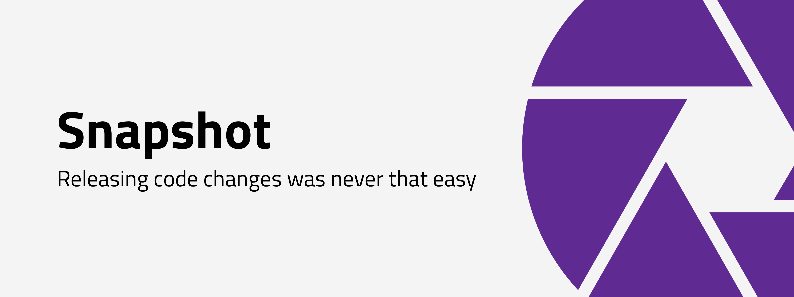

<p align="left">
  <a href="https://plugins.gradle.org/plugin/com.xmartlabs.snapshot-publisher">
    
  </a>
  <a href="https://circleci.com/gh/xmartlabs/android-snapshot-publisher">
    
  </a>
  <a href="https://codebeat.co/projects/github-com-xmartlabs-android-snapshot-publisher-master">
    
  </a>
</p>

Android Snapshot Publisher is a Gradle plugin to **prepare and distribute Android Snapshot versions** to multiple distribution sources in a simple and common way.

The main features of the **preparation process** are:
- Update the Android Version Name to keep track of the distributed versions.
The default behavior adds the commit identifier to the Android Version name.
It's very helpful to track possible issues, for example if a crash occurs, you'll want to know in which snapshot version of the app it happened.
- Create and customize rich release notes based on git's history.

As an example, the following is an automated release note generated by this project.
```text
1.0.1-67a5893: Added pagination in project requests (#150)
Author: Mirland

Last changes:
• Added ripple effect to buttons (#149)
• Change copies in project details screen (#148)
• Add error message when creating a list with the name of an existing one (#147)
• Added filters to organization repositories (#146)
• Import a project automatically after creation (#145)
• Fixed bug that don't delete cards in the db after deleted in the service (#144)
• Fix dashboard view crash and splash screen issue (#143)
• Added languages colors (#142)
• Added progress bar when fetching repositories (#141)
• Added analytics (#140)
• Fix crash that sometimes happened when removing imported projects (#139)
```

This plugin is also meant to easily **deploy** snapshot builds.

Currently the available services are:
- [Google Play](https://play.google.com/apps/publish/)
- [Fabric Beta](https://docs.fabric.io/apple/beta/overview.html)

## Installation

The plugin is hosted in the Gradle Plugin Portal.
```groovy
buildscript {
  repositories {
    maven { url "https://plugins.gradle.org/m2/" }
    maven { url 'https://maven.fabric.io/public' }
  }
  dependencies {
     classpath "com.xmartlabs:snapshot-publisher:0.0.1"
  }
}
```
Apply the plugin to each individual `com.android.application` module where you want to use it.

```groovy
apply plugin: 'com.xmartlabs.snapshot-publisher'
```

> Note that Fabric's Maven Repository must be added to the project because Android Snapshot Publisher plugin uses Fabric's plugin and it's hosted in their Maven Repository.

## Setup
The plugin defines a `snapshotPublisher` block where you can add the different setup alongside the Android modules.

```groovy
snapshotPublisher {
    version {
        // Version customization
    }
    releaseNotes {
        // Release notes customization
    }
    fabric {
        // Fabric Beta setup
    }
    googlePlay {
        // Google Play setup
    }
}
```
The [version](#version-customization) and [releaseNotes](#release-notes) blocks are used to perform the preparation process.
Whereas [fabric](#fabric-beta) and [googlePlay](#google-play) blocks are used to perform the distribution process.

### Version customization
The `version` block allows you to perform version customizations.
The field in that block is optional and its default value is:

```groovy
snapshotPublisher {
    version {
        versionNameFormat = '{currentVersionName}-{commitHash}'
    }
    // ...
}
```

- `versionNameFormat` defines the Android Version Name for the delivered build.
    The default value is the current version name and the short-hash commit, joined by a hyphen.
    
    The possible variables for this value are:
    - `{currentVersionName}`: The current version name.
    - `{commitHash}`: The current git commit hash, in the short format.
    - `{branchName}`: The current git branch name.

    This value can be updated using these optional variables.
    For example, if you want to keep the current version name and the hash commit and add a custom suffix such as `-SNAPSHOT`, you must assign the value `'{currentVersionName}-{commitHash}-SNAPSHOT'` to the `versionNameFormat` variable.

### Release notes
The `releaseNotes` block allows you to perform build release notes customizations.
All fields in that block are optional and their default values are:

```groovy
snapshotPublisher {
    releaseNotes {
        releaseNotesFormat = """{version}: {header}
    
Last Changes:
{commitHistory}
"""
        versionFormat = '{versionName}'
        headerFormat = '%s%n%nAuthor: %an <%ae>%n%B'
        commitHistoryFormat = '• %s (%an - %ci)'
        maxCommitHistoryLines = 10
        outputFile = null
        includeLastCommitInHistory = false
        includeMergeCommitsInHistory = true
    }
    // ...
}
```

> Note: you can test the generated release notes executing the `generateSnapshotReleaseNotes` gradle task.

- `releaseNotesFormat`: Defines the format of the release notes:
    The possible variables to play with in this case are:
    - `{version}` given by `versionFormat`.
    - `{header}` given by `headerFormat`.
    By default it contains information about the most recent commit and their author.
    - `{commitHistory}` given by the result of apply `commitHistoryFormat` to a range of commits.
    By default the range includes all commits from the last -not current- commit to `maxCommitHistoryLines` commits before that.
    If you want to include the last commit in that range, you can set `includeLastCommitInHistory` as `true`.

- `versionFormat`: Specifies the version's variable format.
    
    `{versionName}` (Android app's Version Name) and `{versionCode}` (Android app's Version Code) can be used to create it.

- `headerFormat`: Specifies the header's variable format.
The plugin uses [Git's pretty format] to retrieve the information about the current commit.
If you want to modify this, you may want to use it.

- `commitHistoryFormat`: Specifies the `{commitHistory}` variable format.
As `headerFormat` does, it uses [Git's pretty format] to create the `commitHistory` for the previous commits.

- `maxCommitHistoryLines`: Indicates the number of commits included in `{commitHistory}`.

- `outputFile`: The file where the release notes will be saved.
By default this value is `null` and that means the release notes will be generated and delivered with the snapshot build but it will not be saved in the file system.
If you want to save the release notes in the file system, you can set `outputFile = file("release-notes.txt")`.
You can define it using a relative path (where the start point is the Android application module folder) or an absolute path.

- `includeLastCommitInHistory`: Flag to include the most recent commit in `{commitHistory}`.
By default this value is `false` because it's used in `{header}`

- `includeMergeCommitsInHistory`: Flag to include merge commits in `{commitHistory}`.

### Fabric Beta
This block defines the configuration needed to deploy the artifacts in Fabric's Beta.
This plugin uses [Fabric's beta plugin](https://docs.fabric.io/android/beta/gradle.html), so to be able to release you must have added the Fabric `ApiKey` in the application manifest and the `apiSecret` in the `fabric.properties` file.
For more information about it, you can read [Fabric's setup guide](https://docs.fabric.io/android/fabric/settings/api-keys.html#).

All of the block's fields are optional:

```groovy
snapshotPublisher {
    fabric {
        distributionEmails = []
        distributionGroupAliases = []
        distributionNotifications = true
    }
    // ...
}
```

- `distributionEmails`: The list of email addresses of those who'll get the release.
- `distributionGroupAliases`: The list of names (aliases) of the groups defined inside Fabric's Beta that will get the release.
- `distributionNotifications`: If set to `true`, all build's recipients will get an email notification about the release.

> Note: Fabric's Beta limits your release notes to a maximum of 16384 characters.
Because of that, the plugin trims them up to the last allowed line.

### Google Play

This block defines the configuration needed to deploy the artifacts in Google Play.
This plugin uses [Gradle Play Publisher](https://github.com/Triple-T/gradle-play-publisher).

```groovy
snapshotPublisher {
    googlePlay {
       serviceAccountCredentials = file("your-key.json")
       track = "internal"
       releaseStatus = "completed"
       defaultToAppBundles = false
       resolutionStrategy = "auto"
    }
    // ...
}
```

The only required field is `serviceAccountCredentials`.
To release to Google Play you must create a service account with access to the Play Developer API.
You can [follow the CodePath guide "Automating Publishing to the Play Store"](https://guides.codepath.com/android/automating-publishing-to-the-play-store).

- `serviceAccountCredentials`: contains the service account JSON file with your private key.
- `track`: refers to the Google play tracks. For example, some possible tracks are `internal`, `alpha`, `beta` and `production`.
- `releaseStatus`: the type of the release. The possible values are `completed`, `draft`, `inProgress`, `halted`.
- `defaultToAppBundles`: if set to `true`, the plugin will generate an [App Bundle](https://developer.android.com/platform/technology/app-bundle/) instead of an APK.  
- `resolutionStrategy`: defines the strategy that will take place if a build with the same version code already exists in Google Play (this will throw an error). 
The possible values are `ignore` (it will ignore the error and continue) and `auto` (it will automatically increase the version code for you).

> Note: Google's PlayStore limits your release notes to a maximum of 500 characters.
Because of that, the plugin trims them up to the last allowed line.

## How to use it?

The plugin defines some tasks that can be run.
The naming convention is as follows: `[action][Variant][BuildType]`. For example, `publishSnapshotGooglePlayStagingRelease` will be generated if the app has a `staging` flavor and `release` build type.

To find available tasks, run `./gradlew tasks` and look under the "Snapshot Publishing" section.

The most important tasks are:
- `publishSnapshotFabric[Variant][BuildType]`: it'll publish a snapshot version in Fabric's Beta.   
- `publishSnapshotGooglePlay[Variant][BuildType]`: it'll publish a snapshot version in Google Play.

Some auxiliary tasks are:
- `generateSnapshotReleaseNotes[Variant][BuildType]`: Generates the release notes file.
- `updateAndroidVersionName[Variant][BuildType]`: Changes the app version name to use the version name defined in the `version` configuration's block.
- `prepareApkSnapshotBuild[Variant][BuildType]`: Prepares the snapshot build and creates an apk version.
- `prepareBundleSnapshotBuild[Variant][BuildType]`: Prepares the snapshot build and creates a bundle version.

## Getting involved

* If you **want to contribute** please feel free to **submit pull requests**.
* If you **have a feature request** please **open an issue**.
* If you **found a bug** check older issues before submitting a new one.

**Before contributing, please check the [CONTRIBUTING](.github/CONTRIBUTING.md) file.**

## About
Made with ❤️ by [XMARTLABS](http://xmartlabs.com)

[Git's pretty format]: https://git-scm.com/docs/pretty-formats
